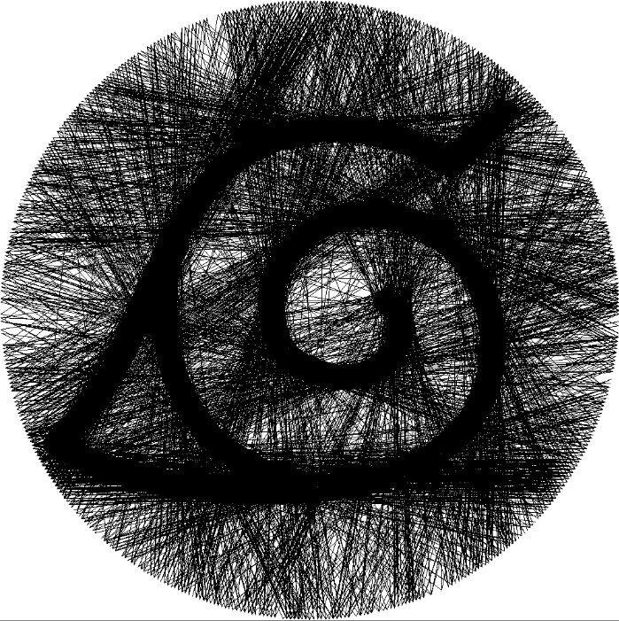
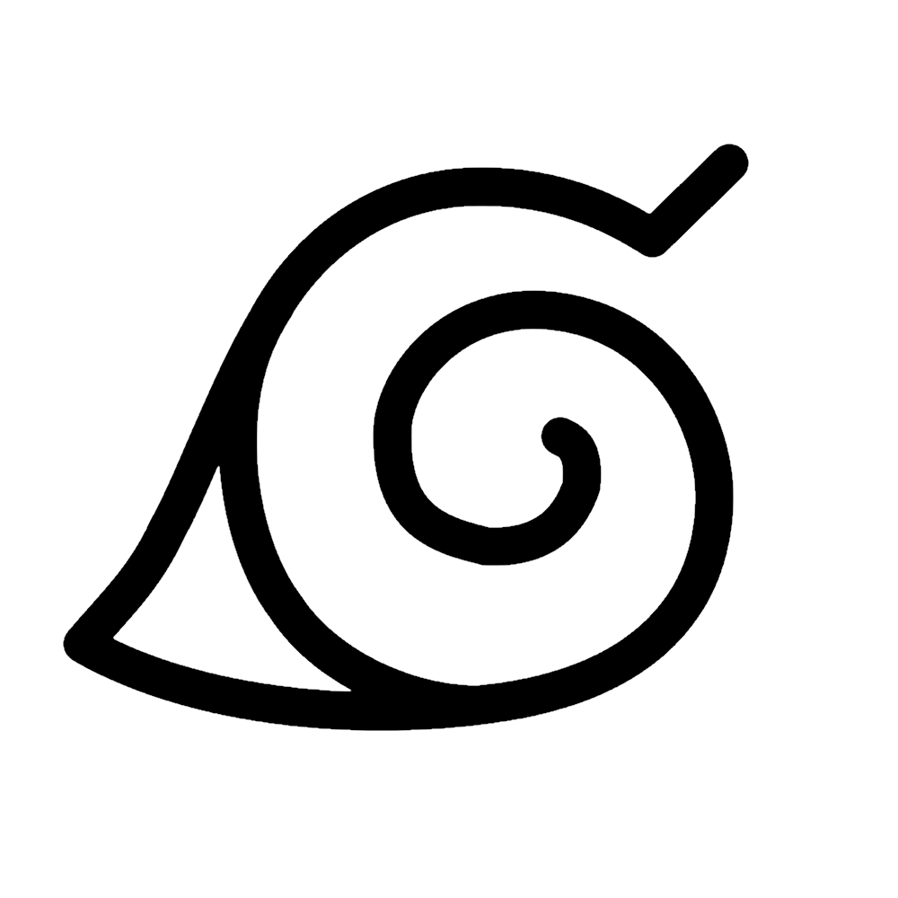

# Tecelã
A idéia é capturar uma imagem e criar dados para tecer usando uma única linha em uma borda circular.

Basicamente é isso:

Vídeo: [Petros Vrellis](https://www.youtube.com/watch?v=G1GnSGQ8PZ8)

## Resultado atual
| Output | Input |
|-------|--------|
|  |  |

**Note:** Atualmente minha implementação está bem simplória em comparação ao que pode vir a ser. Sendo assim, ela funciona melhor com fotos com bastante contraste entre preto e branco. 

## Lógica implementada

1. Coloca-se uma borda circular virtual com `P` pontos equidistantes.
2. Toma o primeiro ponto (`p = 0`) como ponto de partida.
3. Encontra o próximo ponto `p'` para desenhar uma linha a partir do ponto `p`, encontrando a linha de maior intensidade
    - A intensidade de uma linha é calculada somando todos os valores de pixel de uma linha de `p` até `p'`
4. Uma nova linha é desenhada de `p` para `p'` na borda circular.
5. A imagem original é modificada para que os pixels abaixo da linha de `p` para `p'` sejam iluminados, para que a mesma linha não seja desenhada da próxima vez.
6. `p'` é definido como o novo ponto inicial `p`, em seguida, as etapas de são repetidas até que todas as linhas sejam desenhadas. 

**Note:** Afim de manter a uniformidade do circulo, a imagem deve ter altura e largura identicas. Além disso, para melhor experiencia utilize imagens entre 500x500 a 1000x1000 pixels

## Como executar?
- Após o download, é necessário instalar 3 bibliotecas, sendo elas: OpenCV, Math e Tkinter
- Depois disso é só executar o arquivo tecela.py
- Aparecerá para escolher uma foto e depois, no terminal, perguntará a quantidade de pinos que você deseja.
- O terminal avisará quando a imagem estiver pronta.
- Após fechar a imagem, aparecerá para salvar um arquivo de texto contendo todo o caminho percorrido pela linha.

## Credits
[Esse algoritmo](https://github.com/i-make-robots/weaving_algorithm) foi originalmente escrito por [i-make-robots](https://github.com/i-make-robots/).

Eu segui a mesma lógica só que utilizando python e simplificando a aplicação.

